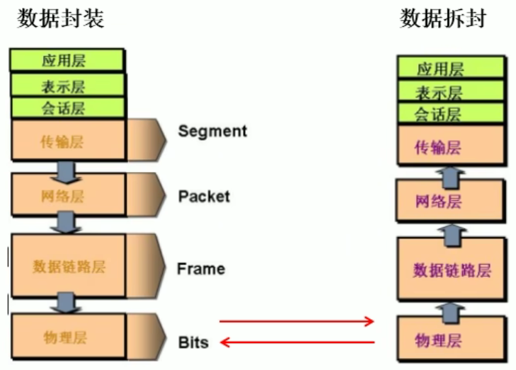
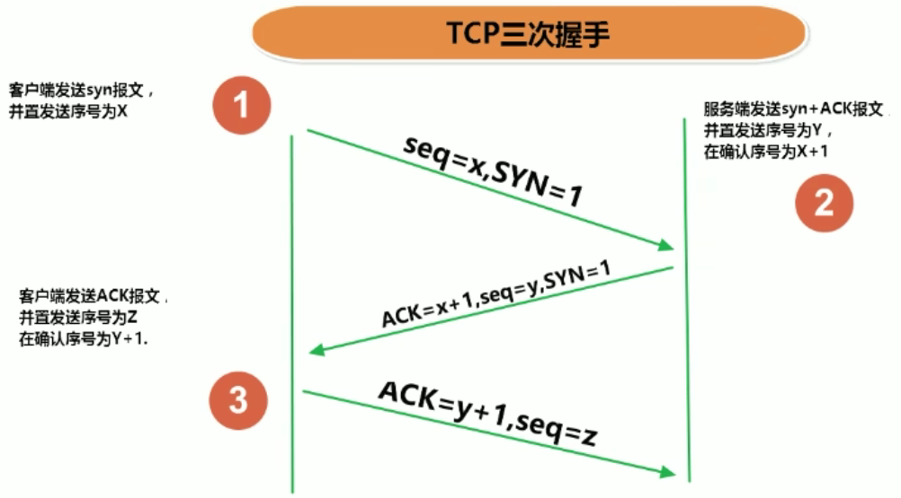
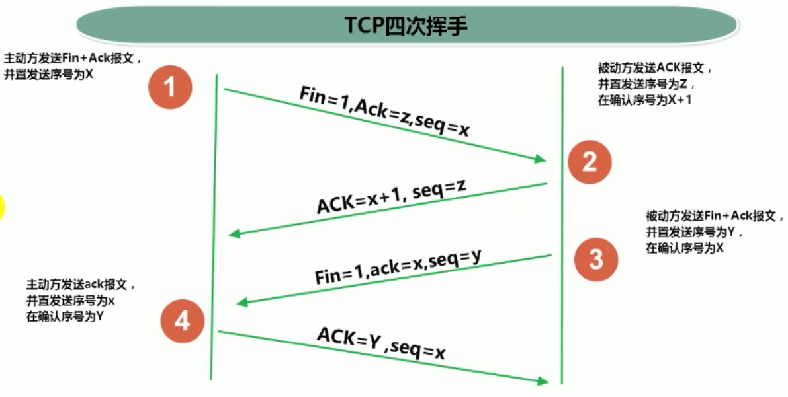

# 网络通信要素概述

## 1 地址

如何**定位**：通信双方地址

- IP
- 端口号

## 2 协议

如何保证**高效可靠的数据传输**：一定的规则

> 即：网络通信协议。有两套参考模型

- OSI参考模型：模型过于理想化，未能在因特网上进行广泛推广
- TCP/IP参考模型（或TCP/IP协议）：事实上的国际标准。

# 通信要素1：IP和端口号

## 1 IP地址

IP地址： 

- 唯一的标识Internet上的计算机(通信实体)

- 本地回环地址(hostAddress)：127.0.0.1 

- 主机名(hostName)：localhost

- IP地址分类方式1：**IPV4**和**IPV6**

  - IPV4: **4个字节**组成，4个0-255。大概42亿，30亿都在北美，亚洲4亿。2011年初已经用尽。以点分十进制表示，如192.168.0.1
  - IPV6: **128位（16个字节）**，写成8个无符号整数，每个整数用四个十六进制位表示，数之间用冒号（`:`）分开，如: 3ffe:3201:1401:1280:c8ff.fe4d:db39:1984

- IP地址分类方式2：**公网地址(万维网使用)**和**私有地址(局域网使用)**。

  - 192.168.开头的就是私有址址，范围即为192.168.0.0---192.168.255.255，专门为组织机
    构内部使用

- 特点：不易记忆。所以需要**域名解析**

  

`java.net.InetAddress`：

- 构造方法私有化了，创建对象需要用`InetAddress.getByXxx(...)`系列方法	
  - `InetAddress.getByName(...)`可以传**IP地址**也可以传**域名**，传域名就多一个**解析**的步骤了
  - 要获取本机IP也可以直接`InetAddress.getLocalhost()`
- 实例的常用方法
  - `getHostName()`
  - `getHostAddress()`

## 2 端口号

端口号标识正在计算机上运行的进程(程序)

- 不同的进程有不同的端口号

- 被规定为一个**16位的整数**0~65535。

- 端口分类:

  - **公认端口**：0~1023。被**预先定义**的服务通信占用

    > 如: HTTP占用端口80，FTP占用端口21，Telnet占用端口23

  - **注册端口**：1024~49151。分配给用户进程或应用程序。

    > 如: Tomcat占用端口8080，MySQL占用端口3306，Oracle占用端口1521等。
    >
    > 当然这个可以改

  - 动态/私有端口: 49152~65535

> :star:**端口号与IP地址的组合**得出一个**网络套接字**：`Socket`
>
> 这也是之后**网络协议编程**要用的，具体创建方法以及使用可以看后面**网络协议编程**

# 通信要素2：网络协议

## 1 协议概述

网络通信协：

- 计算机网络中实现通信必须有一些约定，即通信协议，对速率、传输代码、代码结构、传输控制步骤、出错控制等**制定标准**。

问题：网络协议太复杂

- 计算机网络通信涉及内容很多，比如指定源地址和目标地址，加密解密，压缩解压缩，差错控制，流量控制，路由控制，如何实现如此复杂的网络协议呢?

通信协议**分层**的思想

- 在制定协议时，把复杂成份分解成一些简单的成份，再将它们复合起来。最常用的复合方式是层次方式，即**同层间可以通信、上一层可以调用下一层，而与再下一层不发生关系**。各层互不影响，利于系统的开发和扩展。

## 2 TCP/IP协议簇

传输层协议中有两个非常重要的协议：

- 传输控制协议TCP(Transmission Control Protocol)
- 用户数据报协议UDP(User Datagram Protocol)。

TCP/IP以其两个主要协议：**传输控制协议(TCP)和网络互联协议(IP)**而得名，实际上是一组协议，包括多个具有不同功能且互为关联的协议。

IP(Internet Protocol)协议是**网络层**的主要协议，支持网间互连的数据通信

TCP/IP协议模型从更实用的角度出发，形成了高效的**四层体系结构**，即物理链路层、网络层、传输层和应用层。

## 3 TCP和UDP

TCP协议：

- 使用TCP协议前，须先建立**TCP连接**，形成**传输数据通道**

- 传输前，采用“**三次握手**”方式，**点对点通信**，是**可靠**的

  > 一次或两次“握手”可靠性太低，而三次“握手”就已经足够可靠了，再多几次“握手”可靠性提升也不高

- TCP协议进行通信的两个应用进程：客户端、服务端。

- 在连接中可进行**大数据量的传输**

- 传输完毕，**需释放已建立的连接，效率低**

  > 相当于UDP来说确实效率低；
  >
  > 一般释放连接都是客户端主动释放，服务端非必要不断开 

> 第四次挥手收不到响应才是真的断开了

UDP协议:

- 将数据、源、目的封装成**数据包**，**不需要建立连接**
- 每个**数据报的大小限制在64K**内
- 发送不管对方是否准备好，接收方收到也不确认，故是**不可靠的**
- 可以**广播发送**
- 发送数据结束时**无需释放资源**，**开销小，速度快**

